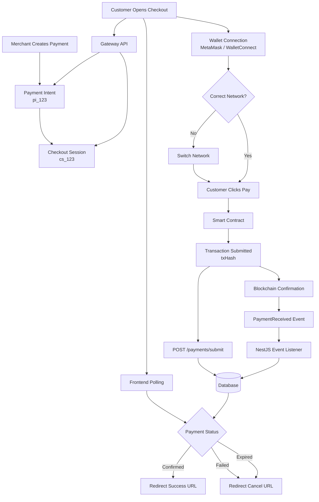
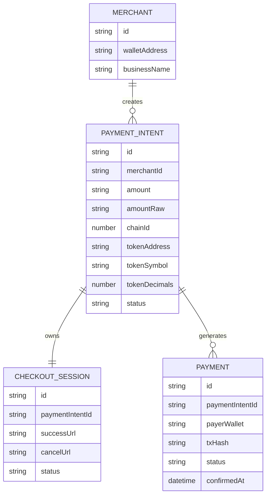
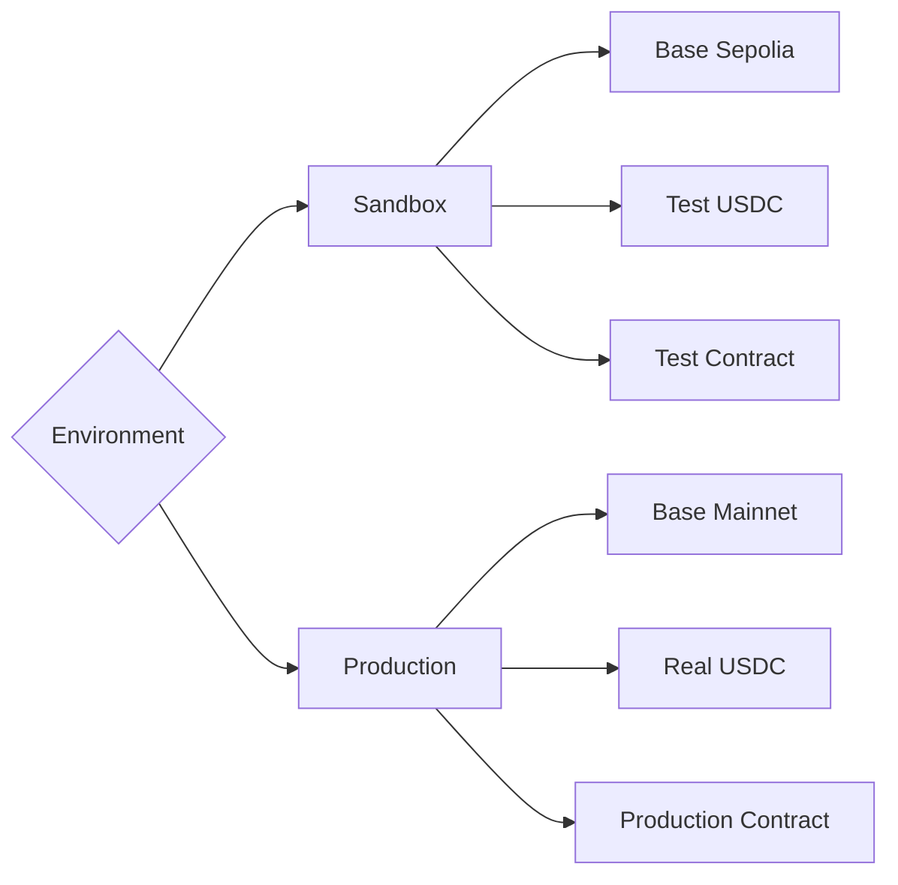
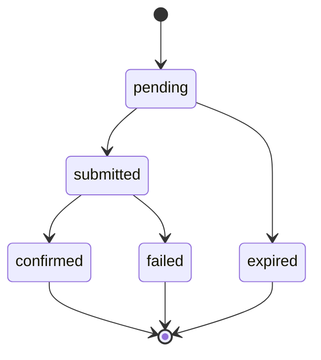

# Payment Gateway Architecture

## Complete Payment Flow



---

# Database Architecture



---

# Environment Architecture



---

# Payment Lifecycle



---

# Explanation

## 1. Merchant Creates Payment

The merchant creates a payment request through the gateway API.

A Payment Intent is generated.

Example:

```json
{
  "id": "pi_123",
  "amount": "10",
  "chainId": 84532,
  "tokenAddress": "0xUSDC"
}
```

The Payment Intent defines:

- Amount
- Token
- Network
- Merchant

---

## 2. Checkout Session Creation

The gateway creates a Checkout Session.

Example:

```json
{
  "id": "cs_123",
  "paymentIntentId": "pi_123"
}
```

The Checkout Session stores:

- Success URL
- Cancel URL
- Checkout status

---

## 3. Customer Opens Checkout

Customer visits:

```txt
https://checkout.gateway.com/cs_123
```

Frontend requests checkout details from the gateway.

Gateway returns:

- Payment Intent data
- Merchant wallet
- Success URL
- Cancel URL

---

## 4. Wallet Connection

Customer connects:

- MetaMask
- Rabby
- Coinbase Wallet
- WalletConnect wallets

The checkout validates:

```ts
walletChainId === paymentIntent.chainId
```

If the customer is on the wrong network, a network switch is requested.

---

## 5. Payment Submission

Customer clicks:

```txt
Pay Now
```

Frontend calls the smart contract:

```solidity
pay(
  paymentIntentId,
  merchantWallet,
  amountRaw
)
```

The wallet displays a transaction approval screen.

---

## 6. Transaction Submitted

After approval the wallet returns:

```txt
txHash
```

Example:

```txt
0xabc123...
```

Frontend sends the transaction hash to the gateway.

```http
POST /payments/submit
```

The gateway stores:

```txt
payments.status = submitted
```

---

## 7. Blockchain Confirmation

The transaction is mined.

The payment contract emits:

```solidity
PaymentReceived(
    paymentIntentId,
    payer,
    merchant,
    amount
)
```

---

## 8. Event Processing

A NestJS listener watches blockchain events.

Flow:

```txt
Smart Contract
      ↓
PaymentReceived
      ↓
NestJS Listener
      ↓
Database Update
```

Updates:

```txt
payments.status = confirmed

payment_intents.status = succeeded
```

---

## 9. Frontend Polling

The checkout periodically requests payment status.

```http
GET /payments/status/pi_123
```

Possible responses:

```json
{
  "status": "pending"
}
```

```json
{
  "status": "confirmed"
}
```

```json
{
  "status": "failed"
}
```

---

## 10. Redirect

When status becomes:

### Confirmed

Redirect:

```txt
successUrl
```

### Failed

Redirect:

```txt
cancelUrl
```

### Expired

Redirect:

```txt
cancelUrl
```

---

# Production Security Model

```txt
Frontend NEVER confirms payments.

Frontend NEVER marks payments as successful.

Backend ONLY trusts:

1. Smart Contract Events
2. Blockchain Confirmation
3. Verified Transaction Hashes
```

This prevents:

- Fake confirmations
- Frontend manipulation
- Client-side payment spoofing

The blockchain remains the single source of truth.
